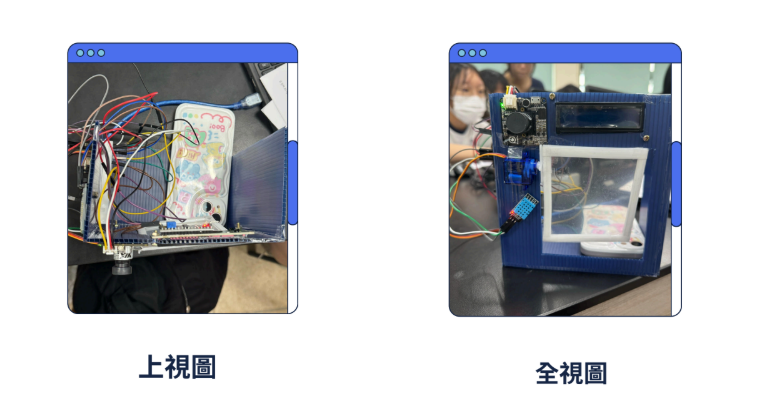
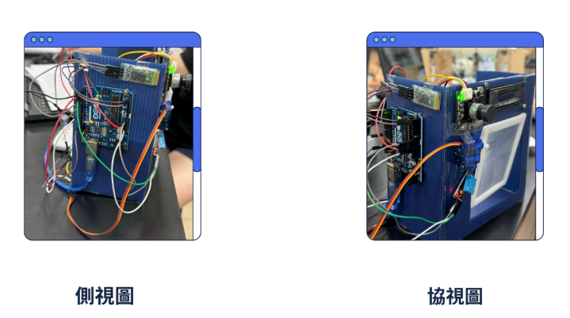
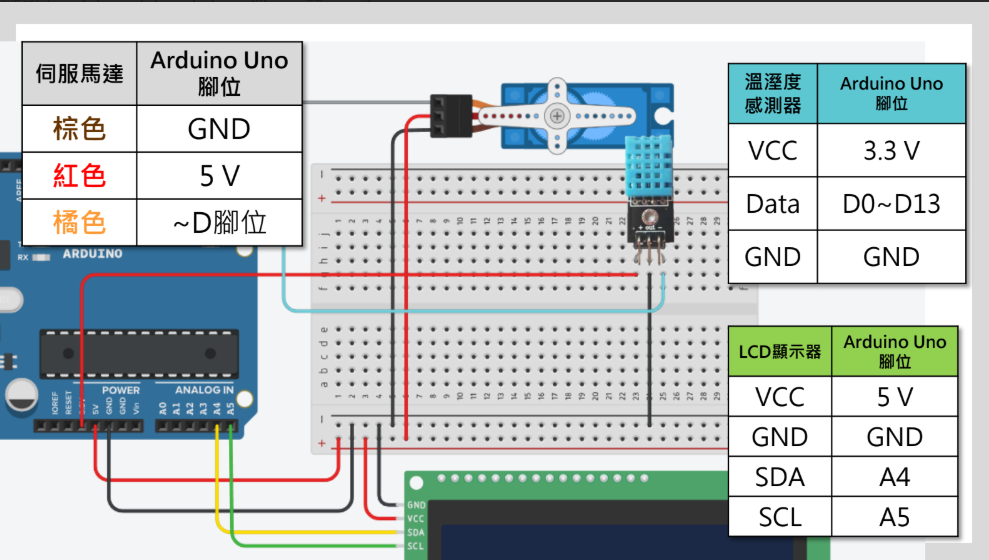
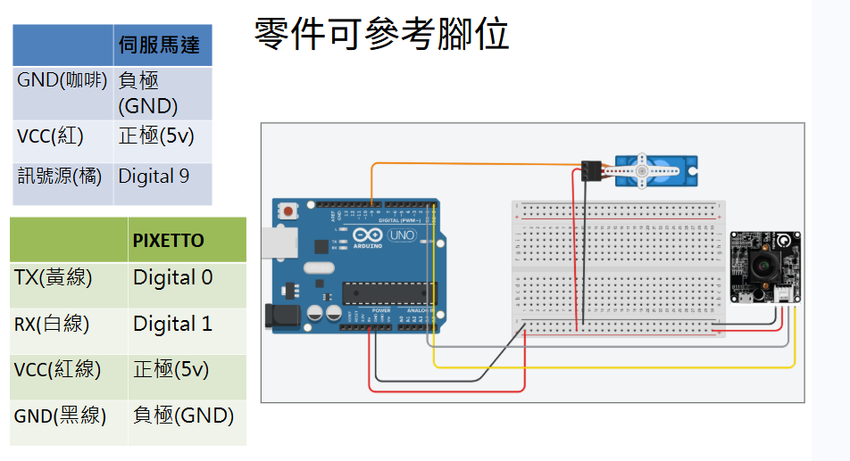
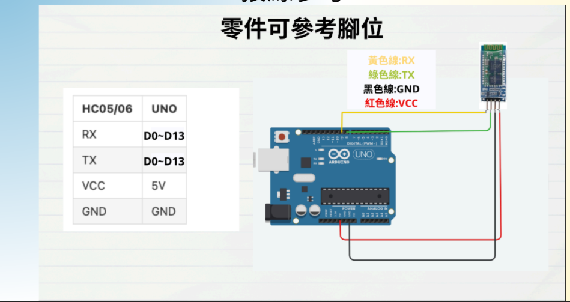

# AIoT Smart Window System

## Project Overview

This project implements an AIoT Smart Window System using Arduino.

The system integrates multiple sensors and communication modules to achieve automatic window control, voice control, and Bluetooth remote control.

## Project Photos

### Front View



### Angle View



## Features

- Real-time temperature and humidity monitoring
- Automatic window opening based on humidity threshold
- Voice control using Pixetto Voice Recognition
- Bluetooth remote control via smartphone
- LCD display for environmental information

## Hardware Components

- Arduino Uno
- DHT11 Temperature & Humidity Sensor
- Servo Motor
- Pixetto Voice Recognition Module
- HC-05 Bluetooth Module
- I2C LCD Display
- ## Wiring Diagram

### Humidity Monitoring Module



### Voice Recognition Module



### Bluetooth Control Module



## System Functions

1. Monitor temperature and humidity.
2. Automatically open the window when humidity exceeds the threshold.
3. Receive voice commands to open or close the window.
4. Control window status through Bluetooth connection.

## Source Code

```text
Arduino_Code/smart_window.ino
```

## Author

Oswin Hsu

National Taiwan Normal University
